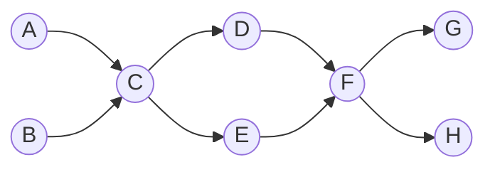

# DPV 3.3 - Topological Ordering Graph

```mermaid
graph LR
  A((A)) --> C((C))
  B((B)) --> C((C))
  C((C)) --> D((D))
  C((C)) --> E((E))
  D((D)) --> F((F))
  E((E)) --> F((F))
  F((F)) --> G((G))
  F((F)) --> H((H))
```

Install Mermaid Extension
Open this file in VSCode and press **Ctrl+Shift+V** (or click the preview button) to see the rendered Mermaid diagram.
